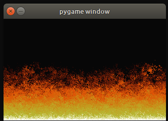

Python Assorted code
====================

Miscellaneous Python code snippets and experiments.

## Running

```
make shell
```

And then from inside the Python 3.7 container install and run whatever you want.

**Note**: Only basic `python 3.7`, `pytest` and `flake8` are installed.


### Individual files / Scripts
* `\list_search.py`: Search prototype for a command-line provided string in all txt files of folder where script is launched. Made for personal use as I keep my catalog of games, movies, etc. in text files. Sample text files format:
```
0   /media/kartones/pre1/test 1/blablabla
123 /media/kartones/pre1/test 1/blablabla2
0   /media/kartones/pre1/test 1
0   /media/kartones/pre1/test 2/blablabla
0   /media/kartones/pre1/test.1/blablabla
```

### Folders / Projects
* `\double-linked-list`: A Python implementation of a double linked list, with sorting, reversing, item flipping and inserting at specific position (by data).
* `\game-of-life-kata`: A coding kata. Inside-out TDD approach + PyGame "visualizer".
* `\pelican\plugins`: Plugins for the Pelican static site generator tool.
* `\pelican\blogengine_to_pelican.py`: Tool to migrate from BlogEngine.Net to Pelican (posts and pages).
* `\pelican\publisher`: Tool to allow post-processing of Pelican builds and optionally upload a post via FTP.
* `\fire-effect.py`: Python/Pygame implementation of Doom PSX fire effect:

* `\pic-to-png`: Exporter from Oper Soft's old MS-DOS games .PIC files to .PNG images.
* `\rpg-combat-kata`: A coding kata. I went for an inside-out TDD approach, building only the minimal needed functionality.
* `\shopping-cart-with-discounts`: Tiny implementation of a shopping cart with an extensible discounts system.
* `\shopping-lists`: A pet project to easily manage shopping lists. Mobile-friendly although nothing too complex nor feature-full. See its README for more details.
* `\trello-backup`: Script to export your trello boards as json files, plus all attachments. One folder per board with data inside.
* `\twitter-purge`: Script to delete your tweets older than X days (5 with sample config). Best setup as a cron job to run hourly or daily.
* `\weather-email`: Small script that fetches Madrid's current weather info and sends it via email. Perfect to be setup as a cron job at 7AM to remind me daily of the weather before I head out for work.
