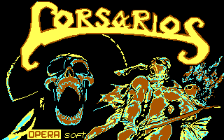

# Opera Soft's PIC to PNG exporter

## Intro

Converts from [Opera Soft](https://en.wikipedia.org/wiki/Opera_Soft)'s MS-DOS games .PIC files to standard PNG. These files were typically loading screens for old games from the company. 

Also, there is a tool with partial support for gathering sprite files (both extracting individual tiles, and assembling a few sprites).

This began as a personal retro reverse engineering attempt to try to grab graphics from the DOS version of [Mutan Zone](http://computeremuzone.com/ficha.php?id=666) game. I was curious of how the image data would be stored to make the code portable to other computers from that era, and found how to "see" the loading/title screens from a few games.

## Setup

- Python 3.5+
- `pip3 install pillow`

## Running

Run the files, and check the help output for the available command-line arguments.

For screens/full images:

```bash
python3 pic_to_png.py
```

For sprites:

```bash
python3 sprites_pic_to_png.py
```

## Example output

### Images





### Sprites


