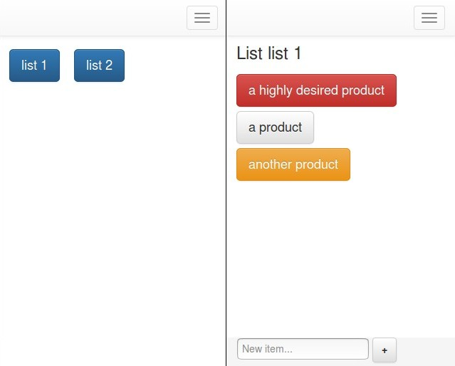

Shopping Lists
==============

A small web application to manage shopping lists. Very simple, file-based, quick to use even from a mobile device or tablet.

## General Instructions

- Tweak `config.py` according to your preferences
- To create a new list you must manually create an empty txt file inside your configured data folder. The name without extension will become the name of the list
- To edit a list, just click it from the lists view and you will enter the items view
- Once viewing items, click/tap them one or more times to change their state to:
    - `Grey`: No need to buy right now ("inactive")
    - `Yellow`: Need to buy ("wanted")
    - `Red`: Important to buy ("highly wanted")
    - `Black`: Remove from list. Will disappear upon changing list or reloading, except if you tap and change its state again
- You can also create new items from the item view at the bottom, just fill the textbox with the item name and press the `+` button

## Development

Just run `make run` and it will tell you the url to access the development version once the container is ready.

### CSS

CSS stylesheet used is [Bootstrap](https://getbootstrap.com/) with tiny tweaks, and most importantly, with all unused CSS removed via [PurgeCSS](https://purgecss.com/CLI.html). Kept the original full css file (in `static/style.original.css`) but unused from the templates.

## Deployment

**Beware of default config values, make sure to change them**. That said, up to you how to deploy it.

And that's all... It was coded in an afternoon (originally in C#/ASP.NET) and then added more states based on feedback.